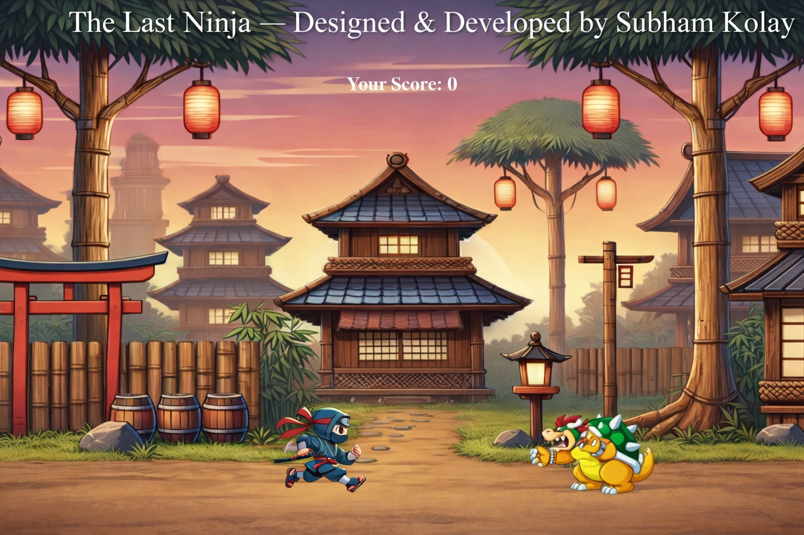

<!-- Anchor for Back to Top -->

# 🥷 The Last Ninja

  <em>
    A <b>solo indie browser game</b>, carefully crafted from scratch using  
    <b>HTML</b>, <b>CSS</b>, and <b>JavaScript</b>.
  </em>

---

## 🎮 Live Demo

  <em>
    Experience the game live in your browser: 
    🔗 <a href="https://sparkly-belekoy-2c37e9.netlify.app/"><b>Play The Last Ninja</b></a>
  </em>

---

## 📖 Overview

  <em>
    <b>The Last Ninja</b> is a lightweight yet engaging <b>2D browser game</b> where  
    the player controls a ninja character to avoid an incoming enemy  
    (<b>Dragon</b>) while scoring points.
  </em>

  <em>
    This project focuses on building a solid foundation in  
    <b>game logic</b>, <b>user interaction</b>, and <b>responsive design</b>,  
    all implemented without the use of any external frameworks.
  </em>

---

## ✨ Key Features

  <em>
    🕹️ <b>Dual Control Mode</b> — Seamless support for both  
    <b>keyboard controls</b> on desktop and <b>touch controls</b> on mobile devices.
  </em>

  <em>
    📱 <b>Mobile-Friendly Design</b> — Fully responsive layout optimized for  
    smartphones and tablets.
  </em>

  <em>
    🎯 <b>Real-Time Collision Detection</b> — Accurate collision handling with  
    instant score updates.
  </em>

  <em>
    🔊 <b>Sound Effects</b> — Immersive background music along with jump and  
    game-over sounds.
  </em>

  <em>
    🔄 <b>Restart System</b> — Quickly restart the game after a game-over event.
  </em>

---

## 🧰 Tech Stack

  
  
  

---

## 🕹️ Controls

  <em>
    <b>Keyboard Mode</b> 
    ⬆️ Jump &nbsp; ⬅️ Move Left &nbsp; ➡️ Move Right
  </em>

  <em>
    <b>Touch Mode</b> 
    On-screen buttons designed for smooth mobile gameplay.
  </em>

---

## 🧠 What I Learned

  <em>
    Through this project, I gained hands-on experience in managing  
    <b>game states</b>, handling <b>multiple input systems</b>, and improving  
    <b>user experience</b> across different devices.
  </em>

  <em>
    It also strengthened my ability to write <b>clean</b>, <b>readable</b>,  
    and <b>maintainable</b> JavaScript code.
  </em>

---

## 👤 Creator

  <em>
    <b>Subham Kolay</b> 
    BTech <b>Computer Science</b> Undergraduate & Aspiring Web Developer
  </em>

  <em>
    An <b>indie game project</b> designed and developed independently as part of  
    my learning journey in <b>web development</b> and <b>game logic</b>.
  </em>

---

## ⭐ Support

  <em>
    If you enjoyed playing <b>The Last Ninja</b>, consider giving this repository  
    a ⭐ on GitHub — your support truly motivates me to keep building!
  </em>

---

  

